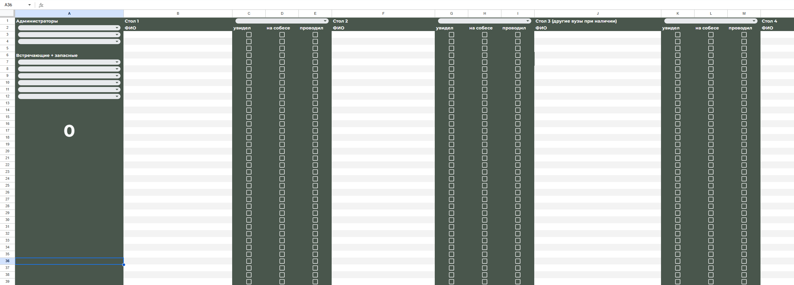
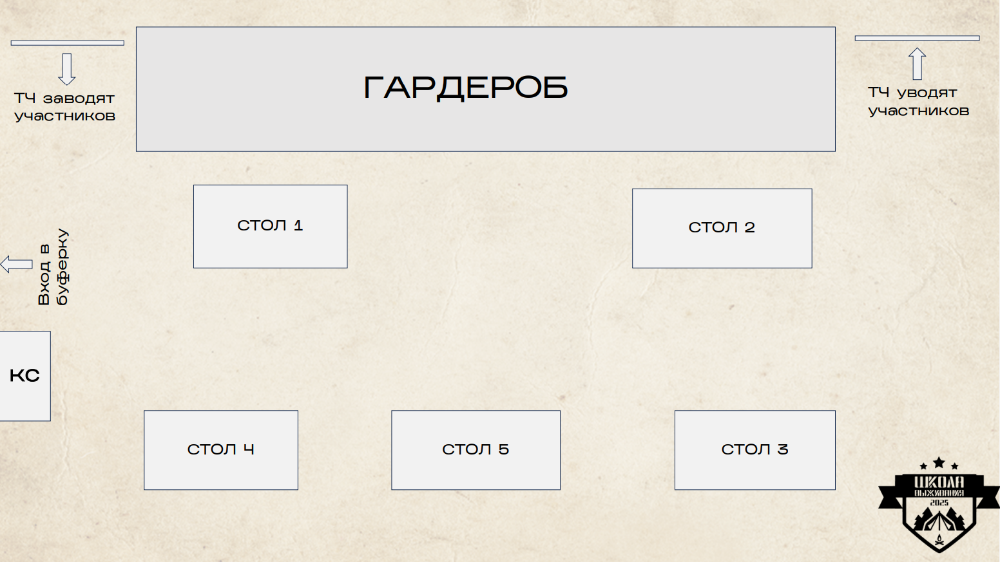
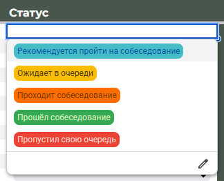
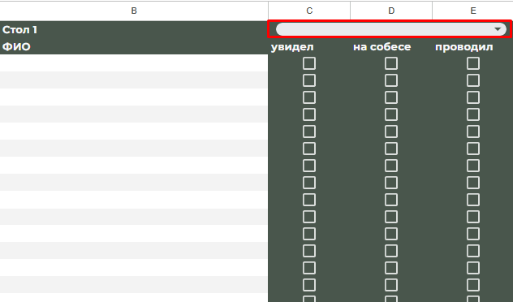

# Инструкция на собеседования для ТЧ ШВ

## Общее
Когда вы приходите на собесы, у вас может быть разный функционал. Задача ТЧ в данном случае — договориться, кто какую роль занимает.

Всего будет три роли:
1. [**Администраторы**](#администраторы)
2. [**Сопровождающие**](#сопровождающие)
3. [**Встречающие + запасные**](#встречающие--запасные)

Подробнее по функционалу каждой роли написано ниже.

Когда вы появляетесь на зоне собесов, помечайте это в таблице, чтобы КС и ТД могли отслеживать и обращаться в случае чего:

- В таблице **ТЧ Собесы 2025** есть актуальный график занятости. Если ваш слот выделен синим, то это значит, что сейчас людей достаточно и вы можете отдохнуть.

### Важные нюансы при работе на собесах:
- Все вопросы к связистам задавать через **Кураторов связистов**.
- **ОЧЕНЬ ВАЖНО** на переменах просить соблюдать тишину / пойти через другой вход / сделать так, чтобы в зоне собесов все оставалось тихо.
- Вести себя **доброжелательно** по отношению друг к другу, к связистам, потенциальным участникам и т.д.
- Если вы не можете прийти в указанный слот, поищите замену и дайте знать об этом в беседе.

Помните, что деятельность на собесах — это не просто выполнение обязанностей, а **крутая возможность** повзаимодействовать как друг с другом, так и со связистами (например, в чилл-зоне).

Расположение столов:

---

## Администраторы
### Основные таблицы:
- [Очередь на собеседования на участника проекта "Школа Выживания 2025"](https://docs.google.com/spreadsheets/d/14KzGUki3NoheR56DyfW1ImqOWapHtp-6fXUxZ16PxzY)
- [ТЧ Собесы 2025](https://docs.google.com/spreadsheets/d/12OMhLhAzxOErj3K_2LYauJIbEUTT33nqQJ0S60g9794)

### Задачи администраторов:
- Менять статус первокурсников в таблице записи на собеседования.
- Распределять первокурсников по столам.
- Следить за личными сообщениями в группе собеседований в ВК (на предмет приезда людей из других вузов).
- Помечать людей, прошедших собесы, в списке анкет.
- **Обязательно приносить с собой ноутбук**.

### Статусы участников в таблице:
- 🔵 **"Рекомендуется пройти на собеседование"** – ставится в 8:50 для первых 10 человек, далее — по наитию для 4-5 ближайших.
- 🟡 **"Ожидает в очереди"** – ставится после подхода человека к столу регистрации.
- 🟠 **"Проходит собеседование"** – ставится при вызове участника на собес.
- 🟢 **"Прошёл собеседование"** – ставится после завершения собеседования.
- 🔴 **"Пропустил свою очередь"** – ставится, если ниже участника прошло 6-7 собесов.

### Важные моменты для администраторов:
1. У некоторых потенциальных участников **есть проходки без очереди** (в бумажном виде). Они должны их предоставить, чтобы пройти собеседование в любой момент. **Забирайте проходки**, чтобы они не передавались другим людям.
2. У ТЧ есть **админки** в [группе собесов ВК](https://vk.com/sossobes2025) – мониторьте сообщения от других вузов. Рекомендуется добавить сообщество в левом меню для быстрого доступа и включить уведомления.
3. **При распределении столов:** придерживайтесь принципа "чем выше в списке, тем приоритетнее".
4. **Другие вузы** направляются на **третий стол** в приоритетном порядке. Стараемся вообще не заставлять их ждать.
5. Можно включить **нейтральную музыку** (швшную).
6. По всем вопросам обращаться к **КС** или **ТД**.
7. **Количество активных столов** уточняйте у КС или сопровождающих.

---

## Сопровождающие
### Основная таблица:
- [ТЧ Собесы 2025](https://docs.google.com/spreadsheets/d/12OMhLhAzxOErj3K_2LYauJIbEUTT33nqQJ0S60g9794)
  

### Задачи сопровождающего:
- Прикрепиться к **одному из столов** в табличке.
- **Мониторить информацию** в таблице.
- **Оповещать связистов** о пришедших участниках.
- **Провожать** участников до стола собеседования и обратно.
- **Отмечать все действия** в таблице.
- **Контролировать время собесов**.

### Детали работы:
1. В таблице укажите свое **ФИО** напротив стола.
2. Администраторы фиксируют имя пришедшего – вы должны это увидеть.
3. **Ставите галочку**, что вы увидели ФИО. Это значит, что вы уже сообщили связистам.
4. Даете связистам пару минут на проверку анкеты.
5. После согласования зовете участника по **ФИО**.
6. Ведете его к столу, **задавая нейтральные вопросы** ("Как настрой?", "Как день?", "Что ожидаешь от собеседования?").
7. Засекаете время и **ставите галочку в таблице**.
8. На 10-й минуте **напоминаете связистам о времени**, но **не давите** – они сами решат, когда заканчивать.
9. После окончания собеседования **провожаете участника обратно**.
10. **Ставите галочку "проводили"** и ждете следующего участника.

---

## Встречающие + запасные
### Задачи встречающих:
- Вовремя **встретить всех участников из других вузов**.
- **Мониторить** [группу собесов](https://vk.com/sossobes2025) на предмет сообщений от других вузов.
- **Встречать и провожать** людей из других вузов.
- Держать **чилл-зону в тишине и порядке**.

### Детали работы:
- В группе собесов ВК у вас будет **админка**, с её помощью можно отслеживать сообщения от других вузов.
- У вас будет **служебка**, которую нужно показывать охране для входа участников в РЭУ.
- После входа проводите участников **до стола администраторов**.
- **После собеседования** участников из других вузов по возможности провожаете обратно.

---

## Вопросы?
Если есть какие-то вопросы, **не стесняйтесь их задавать**!

Если дочитал до конца, то отправь во флуд беседы ТЧ фотографию своего любимого дерева!
